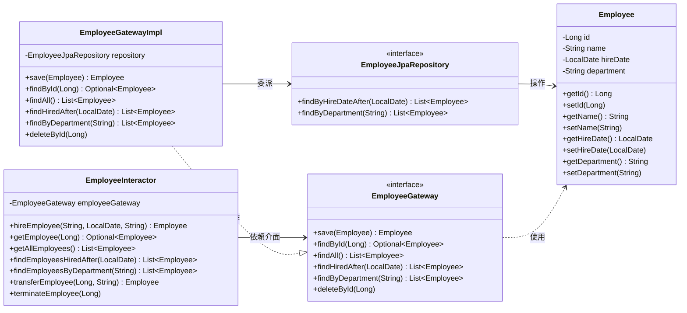
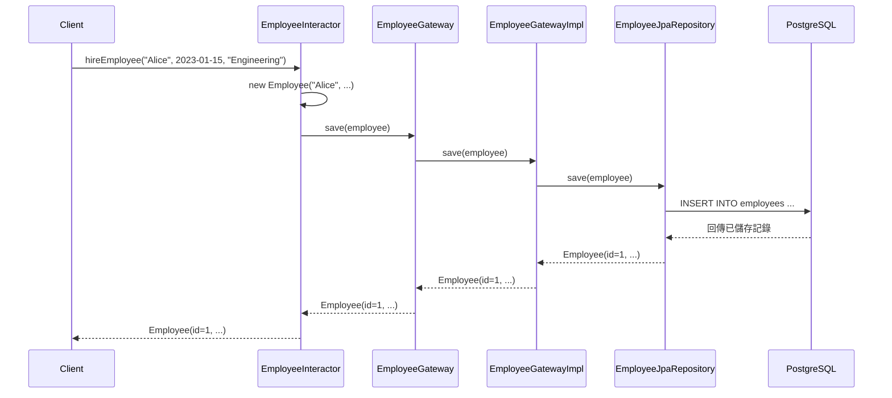
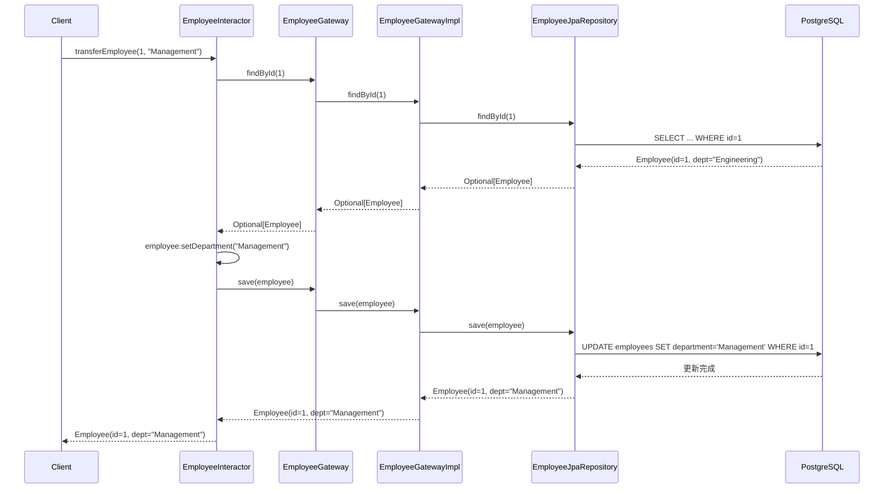
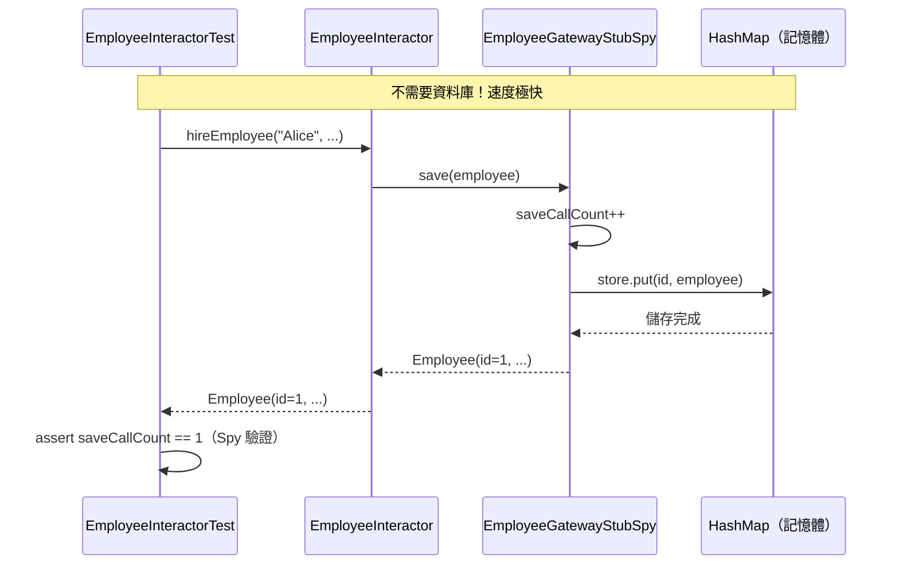
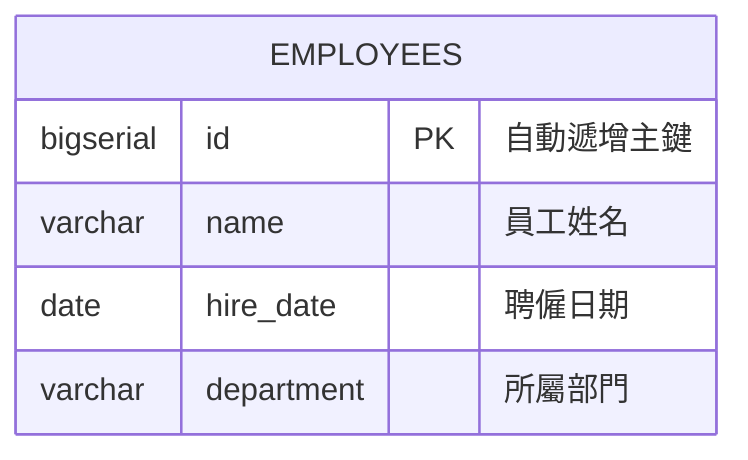

# Gateway Pattern 資料庫測試示範

本專案示範 **Gateway Pattern（閘道模式）** 在 Spring JPA 與 Testcontainers 下的實作與測試策略，取材自 Robert C. Martin《Clean Craftsmanship》第四章。

---

## 專案架構總覽

```
src/main/java/com/example/gateway/
├── GatewayPatternApplication.java      # Spring Boot 啟動入口
├── entity/
│   └── Employee.java                   # JPA Entity（Business Object）
├── gateway/
│   ├── EmployeeGateway.java            # Gateway 介面（抽象邊界）
│   ├── EmployeeGatewayImpl.java        # Gateway 實作（操作 ORM）
│   └── EmployeeJpaRepository.java      # Spring Data JPA Repository
└── interactor/
    └── EmployeeInteractor.java         # Interactor（Business Rules）

src/test/java/com/example/gateway/
├── gateway/
│   └── EmployeeGatewayImplIntegrationTest.java  # 整合測試（Testcontainers）
└── interactor/
    └── EmployeeInteractorTest.java              # 單元測試（Stub/Spy）
```

---

## Class Diagram



### 設計重點

| 角色 | 類別 | 書中對應 |
|------|------|----------|
| **Business Object** | `Employee` | 領域物件，承載業務資料 |
| **Gateway（介面）** | `EmployeeGateway` | 定義資料存取契約，隔離業務邏輯與資料庫 |
| **Gateway IMPL** | `EmployeeGatewayImpl` | 實作閘道，操作 ORM / SQL |
| **Interactor** | `EmployeeInteractor` | 業務規則，僅依賴 Gateway 介面 |
| **Infrastructure** | `EmployeeJpaRepository` | Spring Data JPA，屬於 GatewayImpl 內部細節 |

---

## Sequence Diagram

### 場景一：聘僱員工（hireEmployee）



### 場景二：轉調部門（transferEmployee）



### 場景三：單元測試時（Stub/Spy 取代 GatewayImpl）



---

## ER Diagram



### 欄位對應

| Java 欄位 | 資料庫欄位 | 型別 | 說明 |
|-----------|-----------|------|------|
| `id` | `id` | `bigserial` | 自動遞增主鍵（`@GeneratedValue(IDENTITY)`） |
| `name` | `name` | `varchar(255)` | 員工姓名 |
| `hireDate` | `hire_date` | `date` | 聘僱日期（Spring 自動轉換 camelCase → snake_case） |
| `department` | `department` | `varchar(255)` | 所屬部門 |

---

## 測試策略

本專案完整實踐書中描述的**兩層測試策略**：

```
┌─────────────────────────────────────────────────────────┐
│  單元測試（快速、無資料庫）                                  │
│  EmployeeInteractorTest                                 │
│  ┌───────────────┐     ┌─────────────────────────┐      │
│  │  Interactor   │────▶│  EmployeeGatewayStubSpy │      │
│  │ (Business     │     │  (Stub: 模擬回傳值)       │      │
│  │  Rules)       │     │  (Spy: 記錄呼叫行為)      │      │
│  └───────────────┘     └─────────────────────────┘      │
│  驗證重點：業務邏輯是否正確操作 Gateway 介面                  │
└─────────────────────────────────────────────────────────┘

┌─────────────────────────────────────────────────────────┐
│  整合測試（需要真實資料庫）                                  │
│  EmployeeGatewayImplIntegrationTest                     │
│  ┌───────────────┐     ┌──────────────┐     ┌────────┐  │
│  │  GatewayImpl  │────▶│ JpaRepository│────▶│  PostgreSQL │
│  └───────────────┘     └──────────────┘     │(Testcontainers)│
│  驗證重點：SQL / ORM 查詢是否正確運作                       │
└─────────────────────────────────────────────────────────┘
```

### 書中核心觀點

> **「測試 Business Rules 時，請使用 Stub 和 Spy 來取代 GatewayImpl 類別。」**
>
> 業務邏輯測試不應該依賴資料庫，這樣做速度快、不容易出錯。

> **「測試資料庫這件事就變得很簡單了。你可以建立一個相當簡單的測試資料庫，然後呼叫 GatewayImpl 的每個查詢函數，確保這些函數對測試資料庫產生預期的效果。」**
>
> Gateway 實作的整合測試只需驗證 SQL/ORM 是否正確，不涉及業務邏輯。

### 測試涵蓋率

| 類別 | 指令涵蓋率 | 行涵蓋率 | 方法涵蓋率 |
|------|-----------|---------|-----------|
| EmployeeGatewayImpl | 100% | 100% | 100% |
| EmployeeInteractor | 95% | 94% | 90% |
| Employee | 91% | 89% | 90% |
| **整體** | **92%** | **91%** | — |

---

## 技術棧

| 技術 | 用途 |
|------|------|
| Spring Boot 3.2.5 | 應用程式框架 |
| Spring Data JPA | ORM 資料存取 |
| Hibernate 6.4 | JPA 實作 |
| PostgreSQL 16 | 資料庫 |
| Testcontainers 1.19.7 | 自動啟動測試用 PostgreSQL 容器 |
| JUnit 5 | 測試框架 |
| AssertJ | 流暢斷言 |

---

## 快速開始

```bash
# 前置需求：Docker（Testcontainers 需要）、Java 17+

# 執行所有測試
mvn test

# 僅執行單元測試（不需要 Docker）
mvn test -Dtest=EmployeeInteractorTest

# 僅執行整合測試（需要 Docker）
mvn test -Dtest=EmployeeGatewayImplIntegrationTest
```

---

## 學習資源

- **書籍**：Robert C. Martin,《Clean Craftsmanship》第四章 — Test Design
- **模式**：Gateway Pattern（Martin Fowler, *Patterns of Enterprise Application Architecture*）
- **測試替身**：Stub、Spy、Mock 的區別與使用時機（Gerard Meszaros, *xUnit Test Patterns*）
- **Testcontainers**：[官方文件](https://testcontainers.com/)
